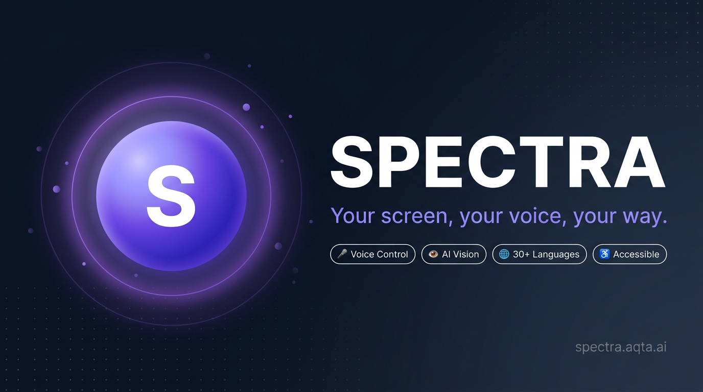
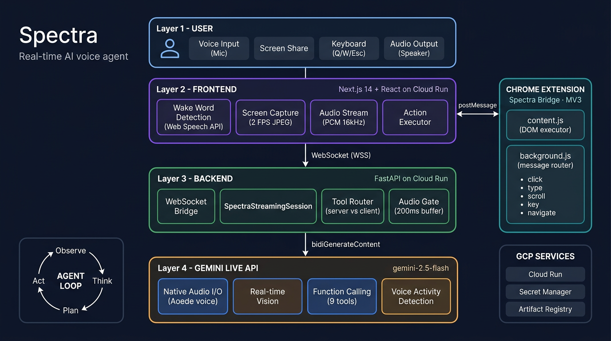
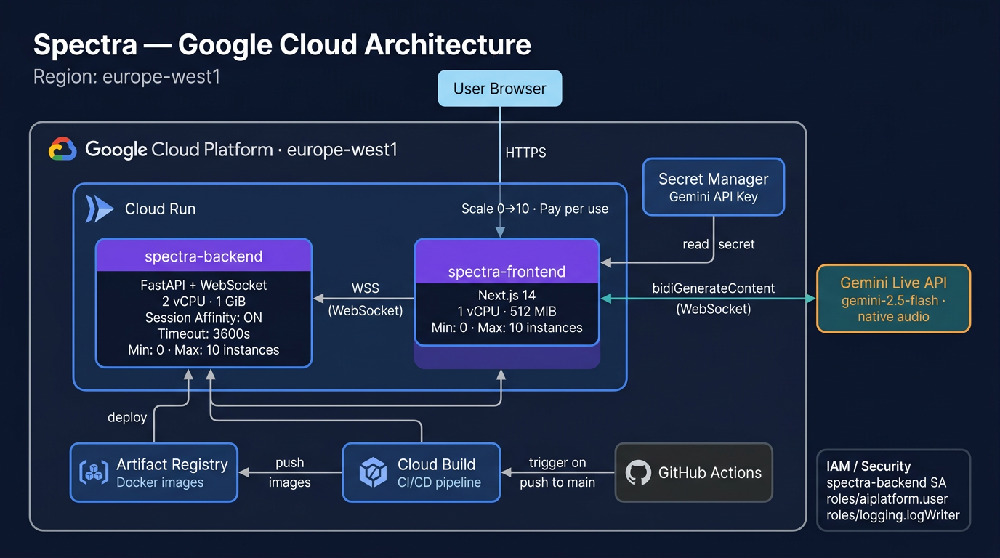

# Spectra

<p align="center">
  
</p>

> Too much reading. Too much staring at screens. Too much typing.
> We built Spectra so you don't have to.

Spectra is a real-time AI agent that understands your screen, highlights what matters, and responds to your voice. It clicks, types, scrolls, and navigates, so you don't have to.

**Built for accessibility. Designed for everyone.**

[](https://spectra.aqta.ai)
[](https://www.youtube.com/watch?v=MJQX4xapRA0)
[](https://spectra.aqta.ai/overlay)
[](https://ai.google.dev/gemini-api/docs/live)
[](https://cloud.google.com/run)
[](https://fastapi.tiangolo.com)
[](https://nextjs.org)


---

Whether you're visually impaired, have RSI, multitasking, or just want hands-free browsing, Spectra uses pure vision AI to understand and control any webpage.

**Your screen, your voice, your way.**

**[Quick Start](#-quick-start)** | **[Architecture](#-architecture)** | **[Accessibility](ACCESSIBILITY.md)** | **[Blind User Test Script](docs/BLIND_USER_MANUAL_TEST_SCRIPT.md)** | **[Troubleshooting](#-troubleshooting)**

---

## The Technology

Every other AI browser agent uses a request/response loop: send a screenshot, wait for a text reply, parse it, act. That model has a floor, there's always a gap, always a turn boundary, always a moment where the AI is gone and you're waiting.

Gemini Live API eliminates that boundary entirely. `bidiGenerateContent` is a persistent bidirectional WebSocket: voice audio streams in continuously, Gemini's native audio streams back in real time, and tool calls (click, type, navigate) interleave with speech mid-conversation. The result is that Spectra *talks while it works*, it doesn't wait until it's finished clicking before responding. It sounds and feels like a person sitting next to you at a computer.

Three Gemini capabilities make this possible and aren't replicated anywhere else:

- **Native audio I/O** — no TTS/STT middleware; Gemini speaks directly with natural prosody and handles interruptions natively via Voice Activity Detection
- **Multimodal Live streaming** — screenshots and audio arrive in the same stream Gemini is already reasoning over; no separate vision API call, no round-trip
- **Thinking with suppressed chain-of-thought** — `gemini-2.5-flash` reasons internally via its thinking budget but we suppress emission of those thoughts, so the model navigates complex multi-step tasks intelligently without leaking internal monologue to the audio stream

No other model family currently exposes all three in a single real-time API.

---

## The Problem

2.2 billion people worldwide have a vision impairment. But even people with perfect vision are exhausted by screens.

### The Accessibility Gap

| Statistic                                       | Source           |
| ----------------------------------------------- | ---------------- |
| 2.2 billion people have vision impairment       | WHO, 2023        |
| 43 million are blind                            | WHO, 2023        |
| 96% of top 1M websites have WCAG failures       | WebAIM, 2024     |
| Average page has 50+ accessibility errors       | WebAIM, 2024     |
| Screen reader users spend 2x-3x longer on tasks | Research studies |

We read for hours. We stare until our eyes burn. We type until our wrists ache. And traditional screen readers? They were built decades ago for a simpler web:

- **Rigid** — linear DOM reading; no understanding of layout, colours, or images
- **Fragile** — break on custom components and dynamic UIs
- **Passive** — they describe but never act; you still click everything yourself
- **Text-only** — they can't interpret visuals, charts, or screenshots

**The gap:** No tool lets you just talk to your screen and have AI both understand and act on what it sees.

---

## What Spectra Does

Spectra is a real-time AI agent that closes the loop between seeing and doing:

- **Sees** — continuously captures your screen via live stream
- **Understands** — Gemini vision interprets layout, text, images, buttons, colours
- **Listens** — you speak naturally: "Where am I?", "Read this article", "Click the blue button"
- **Acts** — executes real UI actions (click, scroll, type, press keys) in your browser
- **Speaks** — responds with natural Gemini audio in 30+ languages, interruptible at any time

No reading. No staring. No typing. Just talk.

### Example Interaction

A blind user wants to catch up on the news, entirely by voice:

```
You: "Go to BBC News and read me the top headline."

Spectra: "You're on BBC News. The top story is: 'Scientists confirm water ice
          found beneath Mars south pole, enough to cover the planet in metres
          of ocean.' Want me to open it?"

You: "Yes, open it."

Spectra: "Opening the article... You're reading: Scientists confirm water ice
          found beneath Mars south pole. The piece starts: Researchers at the
          European Space Agency have confirmed the largest deposit of water ice
          ever detected on Mars, buried two kilometres below the surface near
          the south pole. The discovery, published today in Nature, suggests
          Mars once held a global ocean. Want me to keep reading?"

You: "Yes, keep going."

Spectra: "The lead scientist, Dr Elena Pettinelli, said the finding 'changes
          everything we thought we knew about Mars as a dead planet.' The ESA
          plans a dedicated drilling mission for 2031. There are 47 comments
          on the article. Want me to scroll down to them?"
```

No mouse. No keyboard. No reading. A task that takes a sighted person 30 seconds, done entirely by voice, on any website, without the site needing to support any accessibility standard.

---

## Key Features

| Feature                         | Description                                                          |
| ------------------------------- | -------------------------------------------------------------------- |
| **Voice-first control**        | Speak naturally, Spectra understands intent, not just commands       |
| **Real-time screen vision**    | Continuous 2 FPS screen capture with Gemini multimodal understanding |
| **Browser actions**            | Click, type, scroll, navigate, press keys, all hands-free              |
| **Wake word activation**       | Say "Hey Spectra" to start, no button press needed                    |
| **Barge-in support**           | Interrupt Spectra mid-sentence, she stops immediately                  |
| **Smart page reading**         | Reads headlines, articles, and content aloud with natural pacing      |
| **30+ languages**             | Gemini native audio supports multilingual conversations               |
| **Zero data stored**          | Screenshots in RAM only, nothing saved to disk                       |
| **Accessibility-first**       | Skip links, ARIA labels, screen reader compatible UI                  |
| **Overlay view**              | The page as Spectra sees it, structure, priorities, a11y hints. [spectra.aqta.ai/overlay](https://spectra.aqta.ai/overlay) or localhost:3000/overlay |

---

## Performance


| Metric                    | Value                                   |
| ------------------------- | --------------------------------------- |
| Voice-to-response latency | Sub-second (real-time streaming)        |
| Screen capture rate       | 2 FPS adaptive JPEG                     |
| Audio sample rate         | 16kHz PCM mono (input) / 24kHz (output) |
| Languages supported       | 30+ (Gemini native audio)               |
| Data stored on disk       | Zero, screenshots in RAM only           |
| Source lines of code      | ~8,500 (core application)               |
| Backend test files        | 20 (pytest)                             |
| Docker image size         | ~150MB                                  |


---

## Architecture

Spectra is split into a **Next.js frontend**, a **FastAPI backend** connected to [Gemini Live API](https://ai.google.dev/gemini-api/docs/live), and a **Chrome extension** (Spectra Bridge) for browser actions.

<p align="center">
  
</p>

```
┌─────────────────────────────────────────────────────────────────┐
│                        USER                                     │
│    Voice In   Voice Out   Keyboard                             │
│   Wake word: "Hey Spectra" | Shortcuts: Q / W / Escape          │
└──────────────┬──────────────────────────┬───────────────────────┘
               │                          │
               ▼                          ▲
┌──────────────────────────────────────────────────────────────────┐
│                SPECTRA FRONTEND (Next.js + React)                │
│  • Wake word detection (Web Speech API)                          │
│  • Screen capture (MediaStream → JPEG @ 2 FPS)                  │
│  • Audio streaming (PCM 16kHz ↔ WebSocket)                       │
│  • Action executor (click, type, scroll, keys)                   │
│  • Onboarding guide for new users                                │
└───────────────────┬───────────────────────────────┬──────────────┘
                    │ WebSocket                     │ Extension API
                    ▼                               ▼
┌──────────────────────────────────────────────────────────────────┐
│             SPECTRA BACKEND (FastAPI on Cloud Run)                │
│  • WebSocket bridge: Client ↔ Gemini Live API                    │
│  • Session manager for bidiGenerateContent                       │
│  • System instructions + tool declarations                       │
│  • Action result translation (raw → natural language)            │
│  • Narration filter (suppresses internal monologue)              │
│                                                                  │
│  GEMINI LIVE API (gemini-2.5-flash, native audio)                │
│  • Real-time bidirectional audio streaming (Aoede voice)          │
│  • Vision over live screenshots                                  │
│  • Function calling for UI actions                               │
│  • Voice Activity Detection + barge-in                           │
└──────────────────────────────────────────────────────────────────┘
                                │
                                ▼
┌──────────────────────────────────────────────────────────────────┐
│              SPECTRA BRIDGE (Chrome Extension, MV3)              │
│  • content.js, injected into every tab; executes actions         │
│  • background.js, routes messages to the active tab              │
│  • HiDPI-aware coordinate scaling                                │
│  • Purple highlight overlay for click feedback                   │
└──────────────────────────────────────────────────────────────────┘
```

**Agent tools:**


| Tool                  | Purpose                                             |
| --------------------- | --------------------------------------------------- |
| `describe_screen`     | See what's on screen (vision context for the model) |
| `read_page_structure` | Get all page elements with labels and selectors     |
| `click_element`       | Click by text label or coordinates                  |
| `type_text`           | Type into a field (targets by description)          |
| `scroll_page`         | Scroll up/down/left/right                           |
| `press_key`           | Press Enter, Tab, Escape, arrows, etc.              |
| `navigate`            | Go to a URL                                         |
| `highlight_element`   | Visually highlight an element for feedback          |
| `confirm_action`      | Ask user to confirm before destructive action       |


See `[ARCHITECTURE.md](ARCHITECTURE.md)` for deeper details.

---

## Tech Stack


| Layer           | Technology                                                                            | Why                                                           |
| --------------- | ------------------------------------------------------------------------------------- | ------------------------------------------------------------- |
| AI Model        | [Gemini 2.5 Flash](https://ai.google.dev/gemini-api) (native audio)                   | Multimodal vision + audio + function calling in 30+ languages |
| Real-time Comms | [Gemini Live API](https://ai.google.dev/gemini-api/docs/live) (`bidiGenerateContent`) | Bidirectional streaming audio + tool calls                    |
| Backend         | FastAPI (Python)                                                                      | Lightweight, async WebSockets, easy tooling                   |
| Frontend        | Next.js 14 + TypeScript                                                               | Fast, accessible, PWA-ready                                   |
| Wake Word       | Web Speech API                                                                        | "Hey Spectra" detection runs locally in the browser           |
| Browser Actions | Spectra Bridge (Chrome Extension MV3)                                                 | Direct DOM actions (click, type, scroll) on any tab           |
| Hosting         | Google Cloud Run                                                                      | First-class for Gemini / GCP apps                             |
| Audio           | PCM 16kHz streaming                                                                   | Low-latency mic/speaker via WebSocket                         |
| IaC             | Terraform                                                                             | Reproducible infrastructure for Cloud Run                     |


---

## Project Structure

```
spectra/
├── backend/                    # FastAPI + Gemini Live API
│   ├── app/
│   │   ├── main.py             # FastAPI app + WebSocket endpoint
│   │   ├── agents/
│   │   │   ├── orchestrator.py # Narration filter + response processing
│   │   │   ├── system_instruction.py  # Full system prompt + workflows
│   │   │   └── config.py       # Agent configuration
│   │   ├── streaming/
│   │   │   ├── session.py      # Gemini Live session manager (core)
│   │   │   ├── fast_pipeline.py # Fast response pipeline
│   │   │   └── session_manager.py  # Session state persistence
│   │   └── performance_monitor.py  # Latency tracking + alerts
│   ├── tests/                  # 20 test files (pytest)
│   ├── requirements.txt
│   └── Dockerfile
├── frontend/
│   ├── src/
│   │   ├── app/
│   │   │   ├── page.tsx        # Main UI (voice, convo, status)
│   │   │   └── layout.tsx      # Root layout (a11y-first, skip links)
│   │   ├── hooks/
│   │   │   ├── useSpectraSocket.ts  # WebSocket to backend
│   │   │   ├── useAudioStream.ts    # Mic capture (PCM 16kHz)
│   │   │   ├── useScreenCapture.ts  # Screen capture (adaptive JPEG)
│   │   │   ├── useVoiceActivation.ts# Wake word detection
│   │   │   ├── useWakeWord.ts       # Wake word matching logic
│   │   │   └── useOnboarding.ts     # First-time user guide
│   │   └── lib/
│   │       ├── actionExecutor.ts    # Execute click/type/scroll/navigate
│   │       ├── audioPlayer.ts       # Play Gemini native audio (PCM 24kHz)
│   │       └── extensionBridge.ts   # Communication with Chrome extension
│   ├── package.json
│   └── Dockerfile
├── extension/                  # Spectra Bridge (Chrome Extension MV3)
│   ├── manifest.json
│   ├── background.js           # Service worker message router
│   └── content.js              # DOM action executor
├── infra/
│   ├── main.tf                 # Terraform (Cloud Run, IAM, Service Account)
│   ├── variables.tf
│   └── outputs.tf
├── .github/workflows/          # CI/CD (deploy to Cloud Run on merge)
├── deploy.sh                   # One-command Cloud Run deployment
├── docker-compose.yml
├── ARCHITECTURE.md
├── ACCESSIBILITY.md
├── CONTRIBUTING.md
└── README.md
```

---

## Production readiness checklist

Before going live (e.g. at spectra.aqta.ai), confirm:

| Check | What to do |
| ----- | ---------- |
| **Secrets** | No API keys in frontend or repo. Backend uses `GOOGLE_API_KEY` or Vertex ADC from env only. `.env` and `.env.local` are gitignored. |
| **CORS** | Backend `ALLOWED_ORIGINS` includes your frontend origin (e.g. `https://spectra.aqta.ai`). See `backend/.env.example`. |
| **WebSocket URL** | Frontend `NEXT_PUBLIC_WS_URL` is set to your backend WebSocket URL (e.g. `wss://your-backend.run.app/ws`) in the deployment environment. |
| **Health** | Backend exposes `/health`; Cloud Run / load balancer uses it. Dockerfile includes `HEALTHCHECK`. |
| **Docs off in prod** | FastAPI `docs_url=None`, `redoc_url=None` so `/docs` is not exposed. |
| **Extension** | [Spectra Bridge on Chrome Web Store](https://chromewebstore.google.com/detail/spectra/ocaghbifpjeaaomknnbmckdemhdllnhg) — or load unpacked from `extension/` for local dev. Users need it for click/type/navigate. |
| **Action queue fix** | Backend matches action results by `id` (no cross-talk after timeouts). Session tests pass. |
| **Cookie / consent** | Spectra is instructed to click “Yes, I agree” (or Accept) on cookie banners, not “Settings” or “No”, to avoid loops. |

---

## Quick Start

### Requirements

- **Chrome** (or Chromium-based browser) — required for screen capture and extension
- **Microphone** — required for voice input
- **Google Cloud credentials** — Vertex AI project or Gemini API key
- **Node.js 20+** and **Python 3.11+** (for local development without Docker)

### Try the Live App (fastest)

1. Open **[spectra.aqta.ai](https://spectra.aqta.ai)** in Chrome
2. Install the **[Spectra Bridge extension](https://chromewebstore.google.com/detail/spectra/ocaghbifpjeaaomknnbmckdemhdllnhg)** from the Chrome Web Store
3. Press **Q** to start Spectra
4. Press **W** to share your screen (select any tab or entire screen)
5. Say **"What's on my screen?"** — Spectra will describe what it sees
6. Try commands like **"Go to BBC News"**, **"Read me the top headline"**, **"Click it"**
7. Press **Escape** to stop

### Run Locally with Docker

```bash
git clone https://github.com/Aqta-ai/spectra-ai.git
cd spectra

# Configure credentials (pick one):
cp backend/.env.example backend/.env

# Option A — Vertex AI (recommended):
# Set GOOGLE_CLOUD_PROJECT=your-gcp-project-id in backend/.env
gcloud auth application-default login

# Option B — Google AI Studio API key:
# Set GOOGLE_API_KEY=your-key in backend/.env

docker-compose up
```

Open **[http://localhost:3000](http://localhost:3000)** → install the [Chrome extension](#spectra-bridge-chrome-extension) → press **Q** and start talking.

### Local Development (without Docker)

```bash
# Backend
cd backend
python3 -m venv .venv && source .venv/bin/activate
pip install -r requirements.txt
uvicorn app.main:app --reload --port 8080

# Frontend (separate terminal)
cd frontend
npm install
npm run dev
```

Install the Chrome extension (see [Extension Setup](#spectra-bridge-chrome-extension) below).

---

## Testing & Verification

### Run the Test Suite

Spectra has **20 test files** covering core logic, accessibility compliance, and conversation scenarios:

```bash
cd backend
python3 -m venv .venv && source .venv/bin/activate
pip install -r requirements.txt

# Run all tests (must be run from backend/ so `app` is importable)
pytest tests/ -v

# Run specific test categories
pytest tests/test_session.py -v                    # Core session logic
pytest tests/test_wcag_compliance.py -v            # WCAG accessibility checks
pytest tests/test_blind_user_experience.py -v      # Blind user UX tests
pytest tests/test_screen_reader_compatibility.py -v # Screen reader compatibility
pytest tests/test_conversation_scenarios.py -v     # End-to-end conversation flows
pytest tests/test_connection_recovery.py -v        # Error handling & recovery
```

### Verify Build (no credentials needed)

From the repo root, confirm backend tests and frontend build work:

```bash
# Backend tests (some tests are skipped without GCP)
cd backend && pip install -r requirements.txt && pytest tests/ -q && cd ..

# Frontend build (uses default ws://localhost:8080/ws)
cd frontend && npm ci && npm run build && cd ..

# Docker build
docker compose build
```

### Manual Testing Scenarios

| Scenario             | Voice Command                          | Expected Result                                      |
| -------------------- | -------------------------------------- | ---------------------------------------------------- |
| Screen description   | "What's on my screen?"                 | Spectra describes visible elements, layout, and text |
| Navigation           | "Go to wikipedia.org"                  | Browser navigates to Wikipedia                       |
| Click by description | "Click the search bar"                 | Spectra clicks the search input field                |
| Type text            | "Type 'artificial intelligence'"       | Text appears in the focused input                    |
| Read content         | "Read this page"                       | Spectra reads the main content aloud                 |
| Multi-step task      | "Search Google for weather in Dublin"  | Navigates to Google, types query, presses Enter      |
| Interrupt (barge-in) | Say anything while Spectra is speaking | Spectra stops immediately and listens                |
| Keyboard shortcut    | Press **Q**                            | Toggles Spectra on/off                               |

---

## Cloud Deployment

<p align="center">
  
</p>

One command deploys backend + frontend to Cloud Run with Vertex AI:

```bash
./deploy.sh your-gcp-project-id europe-west1
```

This will:

- Enable required GCP APIs (Vertex AI, Cloud Run, Cloud Build)
- Create a `spectra-backend` service account with `roles/aiplatform.user`
- Deploy the FastAPI backend to Cloud Run (Vertex AI auth via service account, no API key needed)
- Build and deploy the Next.js frontend via Cloud Build
- Wire CORS between frontend and backend

**Terraform (IaC):** See `[infra/](infra/)` for Terraform that provisions the same infrastructure:

```bash
cd infra
cp terraform.tfvars.example terraform.tfvars   # fill in your values
terraform init && terraform apply
```

---

## Usage

Visit [http://localhost:3000](http://localhost:3000) (or your Cloud Run URL).

### Getting Started

1. **Open the page you want to interact with** in a separate tab (e.g. bbc.com, google.com). Spectra executes actions in your most recently used non-Spectra tab.
2. **Press Q** or say **"Hey Spectra"** to start
3. **Press W** to share your screen — select the tab with the page you want to control
4. **Talk naturally** using the commands below
5. **Say "Stop"** or press **Escape** to halt

### Keyboard Shortcuts

| Key        | Action               |
| ---------- | -------------------- |
| **Q**      | Start / stop Spectra |
| **W**      | Share screen         |
| **Escape** | Stop Spectra         |

### Voice Commands

| Command               | What it does                          |
| --------------------- | ------------------------------------- |
| "What's on screen?"   | Describes current page                |
| "Click the [element]" | Clicks a button, link, or element     |
| "Type [text]"         | Types into the focused field          |
| "Search for [query]"  | Types in search bar and presses Enter |
| "Go to [site]"        | Navigates to a URL                    |
| "Scroll down / up"    | Scrolls the page                      |
| "Press Enter / Tab"   | Presses a key                         |
| "Read this page"      | Reads content aloud                   |
| "Stop" / "Cancel"     | Cancels current action                |

### Wake Words (hands-free activation)

Say any of these to activate Spectra without pressing Q:

- **"Hey Spectra"**
- **"Start Spectra"**
- **"OK Spectra"**
- **"Spectra"**

---

## Spectra Bridge (Chrome Extension)

Spectra requires **Spectra Bridge**, a Chrome extension that executes browser actions (click, type, scroll, navigate) on any webpage. Without this extension, Spectra can describe your screen but cannot perform actions.

### Install

**Option A — Chrome Web Store (recommended):**

Install [Spectra from the Chrome Web Store](https://chromewebstore.google.com/detail/spectra/ocaghbifpjeaaomknnbmckdemhdllnhg) — no developer mode needed.

**Option B — Load unpacked (for local development):**

1. Open Chrome and go to `chrome://extensions/`
2. Enable **Developer mode** (toggle, top right)
3. Click **Load unpacked**
4. Select the `extension/` folder from this repo

### How It Works

- **content.js** — injected into every tab; listens for action messages and executes them (click, type, scroll, key press, navigate). Shows a purple highlight overlay on clicked elements.
- **background.js** — service worker that routes messages from the Spectra frontend to the active tab. Handles tab verification and race conditions.

### Actions

| Action              | What it does                                                                |
| ------------------- | --------------------------------------------------------------------------- |
| `click`             | Clicks element at coordinates with HiDPI-aware scaling and purple highlight |
| `type`              | Types text into focused input or contentEditable                            |
| `scroll`            | Scrolls the page in any direction                                           |
| `key`               | Presses a key (Enter, Tab, Escape, arrows, etc.)                            |
| `navigate`          | Navigates the tab to a URL                                                  |
| `highlight_element` | Shows visual highlight without clicking                                     |
| `read_selection`    | Reads selected text, paragraph, or full page                                |

### Permissions & Trust

The extension requires `<all_urls>` permission to execute actions on any website. The extension:

- Does not collect or transmit your data
- Only executes commands from the Spectra frontend tab
- Is fully open source for transparency

---

## Safety, Ethics & Privacy

See our full [Privacy Policy](PRIVACY.md) for details.

### What We Control

- **No data storage** — screenshots are held as a single variable in memory; each new frame replaces the last. No files, no database, no cloud storage.
- 🚫 **No accounts, no tracking, no analytics**, self-hosters bring their own API key.
- **User always in control** — "Stop" or "Cancel" at any time.
- **Open source** — Apache 2.0 for transparency and community audit.

### What Leaves Your Machine

- **Screen frames and audio are sent to Google's Gemini API** for vision analysis and voice processing. This is required for Spectra to function.
- **Google's data handling:** Data sent via the Gemini API is subject to [Google's privacy policies](https://policies.google.com/privacy) and [Gemini API terms](https://ai.google.dev/gemini-api/terms).
- **No other third-party services** access your data.

---

## Fun Facts

- **Zero mouse clicks required** — 100% voice + keyboard controllable
- **1 screenshot = ~80KB** — JPEG frames, not video, saving 95% bandwidth
- **Barge-in works** — interrupt Spectra mid-sentence and she stops immediately
- **Wake word runs locally** — "Hey Spectra" detection never leaves your browser
- **Aoede voice** — named after the Greek muse of song
- **Hardest bug** — WebSocket race conditions; 3 days to fix with single-reader pattern
- **Why "Spectra"?** — sees the full spectrum of your screen: colours, layout, text, images

---

## Troubleshooting


| Issue                  | Fix                                                                                                  |
| ---------------------- | ---------------------------------------------------------------------------------------------------- |
| Backend won't start    | Check Python 3.12+, virtualenv, `GOOGLE_CLOUD_PROJECT` in `.env`, port 8080                          |
| Frontend won't start   | Check Node 20+, `npm install`, `NEXT_PUBLIC_WS_URL` in `.env.local`                                  |
| Voice not working      | Use Chrome/Edge, check mic permissions, try keyboard Q shortcut                                      |
| Screen sharing denied  | Spectra works in text-only mode without screen sharing                                               |
| Extension not detected | Reload extension at `chrome://extensions/`, ensure on [http://localhost:3000](http://localhost:3000) |
| No audio output        | Check browser autoplay policy, click the page once to enable audio                                   |
| Click/type not working | **Open the target page in a separate tab** — Spectra must have the page you want to interact with open in another tab. The extension routes actions to the most recently accessed non-Spectra tab. Refresh the target tab if needed. |
| Overlay "Failed to fetch" | Ensure backend is running and `ALLOWED_ORIGINS` includes the frontend URL. Overlay requires `GOOGLE_API_KEY` or `GOOGLE_CLOUD_PROJECT` in backend env. |

See the table above for common fixes.

---

## Contributing

Spectra is open source and built for the accessibility community.

**Ways to contribute:**

- Report bugs and suggest features
- Improve docs and accessibility
- Add new capabilities (e.g., app-specific workflows)
- Test with screen readers and real users
- Translate to other languages

See `[CONTRIBUTING.md](CONTRIBUTING.md)` for details.

---

## Disclaimer

**Spectra is an experimental research project and proof-of-concept.**

- **Not a certified medical device**, not approved by any regulatory authority
- **Not a replacement for professional assistive technology**, this is a research prototype
- **Use at your own risk**, provided "as is" without warranties (Apache 2.0)

If you rely on assistive technology for daily tasks, please continue using your certified tools. Spectra is intended as a complementary experimental tool.

---

## Licence

Apache License 2.0, see [LICENSE](LICENSE).

---

## Acknowledgments

- **[Google Gemini](https://ai.google.dev/gemini-api)**, the 2.5 Flash model with native audio and vision capabilities powers Spectra's real-time understanding
- **[Gemini Live API](https://ai.google.dev/gemini-api/docs/live)**, bidirectional streaming enables natural voice conversation
-  **Web Speech API**, browser-native wake word detection
-  **Open Source Community**, inspiration from accessibility tools and AI agents

Built for **#GeminiLiveAgentChallenge**

---

## Maintainer

**Anya Chueayen**, Aqta Technologies Ltd, Dublin, Ireland

---

⭐ **Star this repo if you find it helpful!**

💜 **Share with others who might benefit from accessible tools.**